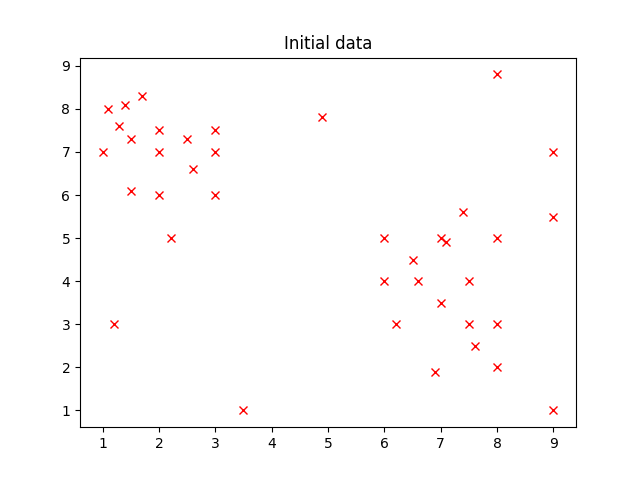
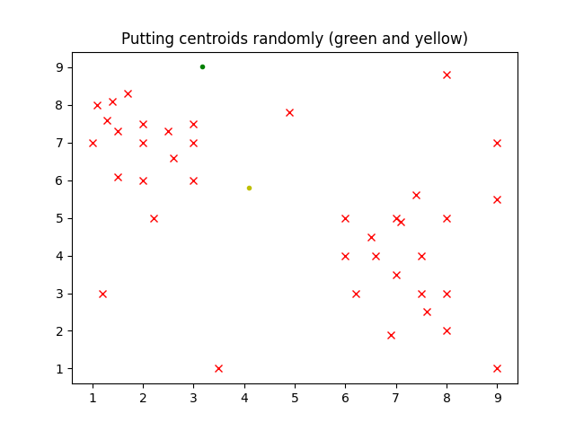
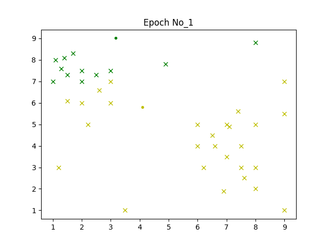
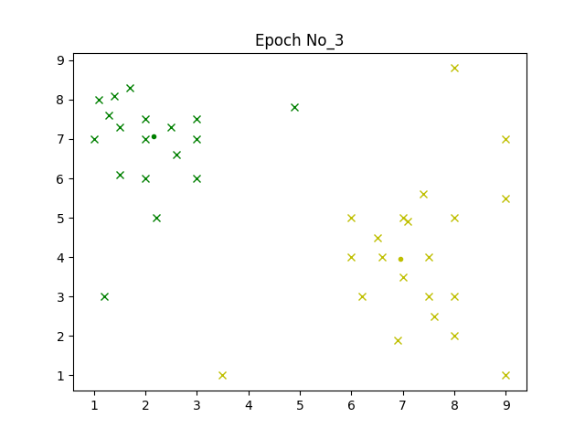

# Illustration of how K-means algorithm works

## Overview

Data is of point type with 2 coordinates x & y.
Randomly generated.

## How to run

1) `pip install -r requirements.txt`

2) `python main.py`

## Sample output

